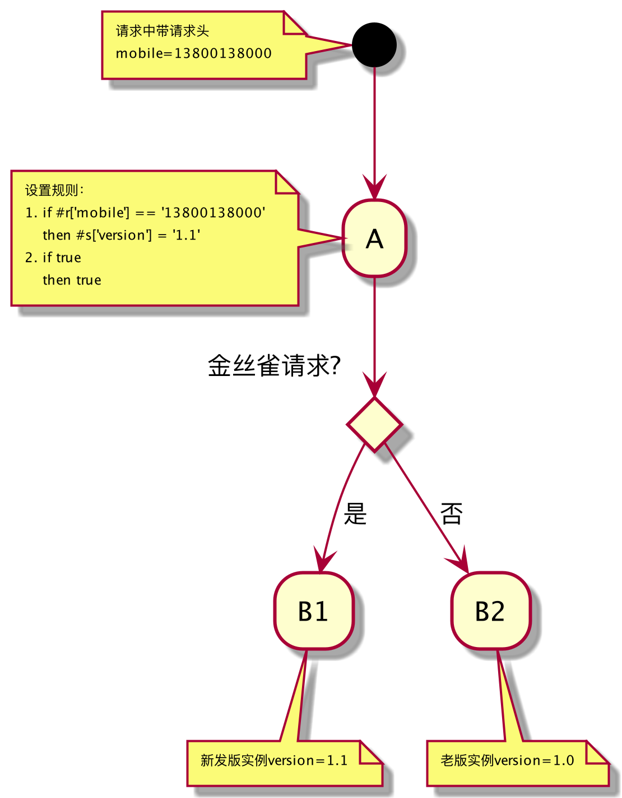

# smurf 灰度功能

与其说这是一个灰度功能，不如说他是一个全维度的智能路由功能，因为它几乎可以实现当前流行的所有路由相关功能，如：
- 金丝雀发布
- 蓝绿发布
- A/B Test
- 权重设置
- 跨注册中心/跨机房
- 故障节点实时隔离
- 项目重构时的流量导向

# 原理

很多人都很好奇，为什么区区几百行的代码能实现这么多的功能，无数身边人提出过类似怀疑，甚至现在仍然在怀疑中，但却从来不过问为什么。

事实上，原理很简单，就是一个预先设定的规则集和一个特定环境的上下文，两者结合得到一个可用的下游服务实例。

- 规则集：和众多规则一样，可事先设定，也可动态改变，它是一份可随时修改的数据，与代码无关。
规则，通俗的理解就是：当满足前提条件时，则从一个服务实例全集中过滤出符合要求的子集。
规则集，就是多个规则以一定顺序组合而成的集合，以防止一条规则不符合要求时，可从下一优先级的规则中过滤服务实例子集。
如：

  如果客户端满足：#r['mobile'] matches '158211[0-9]{5}' 

  则筛选服务端实例：#s['area'] == 'shanghai'

  如果客户端满足：#r['mobile'] not matches '158211[0-9]{5}' 

  则筛选服务端实例：#s['area'] == 'beijing'

  因城市不仅仅只有上海和北京，所以往往在以上两条规则之后再添加一条兜底规则作为备用：

  如果客户端满足：true 

  则筛选服务端实例：true

- 上下文：规则集中存在很多变量，如#r['mobile']和#s['area']，脱离上下文，谁都不知道是true还是false，
只有当一个请求进入某一个服务实例时，请求加上服务实例本身构成了一个上下文，请求有headers、cookie、body、url，
而服务实例有部署的区域信息、版本信息、集群信息、机房信息、系统负载信息等，甚至还有请求进入实例时的时间信息，
这些信息都构成了判断规则所需的上下文。当然，为了避免上下文过大，可以有针对性的裁剪，并不一定是大而全。

## 场景

### 金丝雀发布

金丝雀发布是一种在发布过程中常用的验证新发版实例是否符合预期的手段。

既然是金丝雀发布，那就先定义何为金丝雀，测试账号？内部用户？区域用户？还是说专门维护着一份白名单的用户？
总之，只要一个请求进入上游服务时，能甩选出来就可以，该标志一般保存在请求header中。

上图中mobile可以是测试用户手机号，也可以是白名单用户，类似的规则还可以是这样：

if 前端app版本 >= 101

then 下游服务版本 == 1.1

if 前端app版本 < 101

then 下游服务版本 == 1.0

注意：此时 >= 101 和 < 101， 以及 == 1.1 和 == 1.0分别已经是两个全集，也就不需要兜底规则了。

### 蓝绿发布

### A/B Test

### 权重设置

### 跨注册中心/跨机房

### 故障节点实时隔离

### 项目重构时的流量导向
